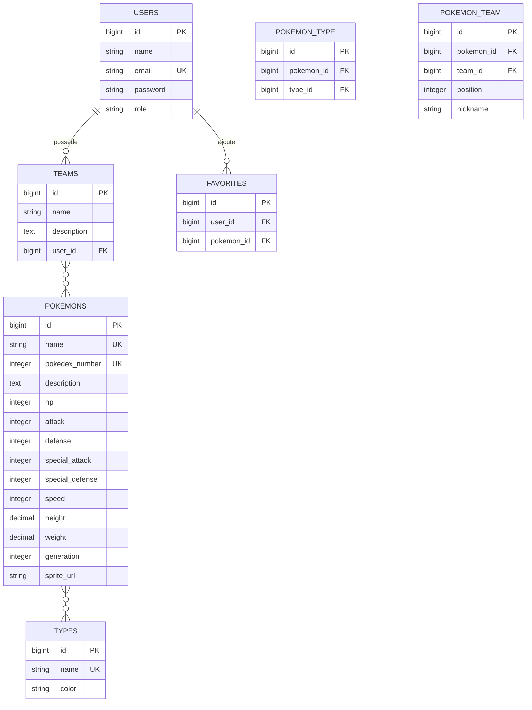

# 🔴 Pokédex Laravel

> Application web de Pokédex développée avec Laravel.
> Consulte 50 Pokémon, gère tes favoris et compose tes équipes.

## 📋 Table des matières

- [Fonctionnalités](#-fonctionnalités)
- [Prérequis](#-prérequis)
- [Installation](#-installation)
- [Comptes de test](#-comptes-de-test)
- [Structure du projet](#-structure-du-projet)
- [Base de données](#-base-de-données)
- [Stack technique](#-stack-technique)
- [Auteur](#-auteur)

## ✨ Fonctionnalités

### Pokédex
- Consultation de 50 Pokémon avec fiches détaillées (6 stats, types)
- Recherche par nom et filtrage par type
- Barres de stats visuelles avec code couleur
- Pagination

### Gestion d'équipes (CRUD complet)
- Création, modification et suppression d'équipes
- Ajout de Pokémon (max 6 par équipe) avec surnom optionnel
- Visualisation des slots occupés/vides

### Système de favoris
- Ajout/retrait via bouton cœur
- Page dédiée aux favoris

### Administration
- Dashboard avec statistiques
- CRUD complet sur les Pokémon
- Gestion des utilisateurs (rôles)
- Visualisation de toutes les équipes

### Sécurité
- Authentification via Laravel Breeze
- Middlewares `auth` et `admin`
- Vérification de propriété sur les équipes
- Validation via Form Requests
- Protection CSRF

## 🔧 Prérequis

- **PHP** >= 8.1
- **Composer** >= 2.x
- **Node.js** >= 18.x & **NPM**
- **SQLite**

## 🚀 Installation

```bash
# 1. Cloner le dépôt
git clone https://github.com/Astro-Kosmic/Lucas_PEREZ_ESGI2_Laravel.git
cd Lucas_PEREZ_ESGI2_Laravel

# 2. Installer les dépendances
composer install
npm install

# 3. Configurer l'environnement
cp .env.example .env
php artisan key:generate

# 4. Créer et peupler la base de données
touch database/database.sqlite
php artisan migrate:fresh --seed

# 5. Compiler les assets
npm run build

# 6. Lancer le serveur
php artisan serve
```

L'application est accessible à l'adresse : `http://localhost:8000`

## 🔑 Comptes de test

| Rôle | Email | Mot de passe | Accès |
|------|-------|-------------|-------|
| **Admin** | `admin@pokedex.com` | `password` | Pokédex, Équipes, Favoris, Panel Admin |
| **Utilisateur** | `user@pokedex.com` | `password` | Pokédex, Équipes, Favoris |

> Le compte utilisateur dispose de 2 équipes et 8 Pokémon en favoris.

## 📁 Structure du projet

```
app/
├── Http/
│   ├── Controllers/
│   │   ├── Admin/
│   │   │   ├── AdminDashboardController.php
│   │   │   ├── AdminPokemonController.php
│   │   │   ├── AdminTeamController.php
│   │   │   └── AdminUserController.php
│   │   ├── FavoriteController.php
│   │   ├── HomeController.php
│   │   ├── PokedexController.php
│   │   └── TeamController.php
│   ├── Middleware/
│   │   └── AdminMiddleware.php
│   └── Requests/
│       ├── StorePokemonRequest.php
│       ├── StoreTeamRequest.php
│       ├── UpdatePokemonRequest.php
│       └── UpdateTeamRequest.php
├── Models/
│   ├── Favorite.php
│   ├── Pokemon.php
│   ├── Team.php
│   ├── Type.php
│   └── User.php
database/
├── factories/
├── migrations/ (7 fichiers)
└── seeders/DatabaseSeeder.php
resources/views/
├── admin/
├── components/pokemon-sprite.blade.php
├── favorites/
├── layouts/app.blade.php
├── pokedex/
└── teams/
```

## 🗄️ Base de données



## 🛠️ Stack technique

| Composant | Technologie |
|-----------|------------|
| Framework | Laravel |
| Auth | Laravel Breeze |
| BDD | SQLite |
| Frontend | Blade + Tailwind CSS |
| Build | Vite |

## 👤 Auteur

**Lucas PEREZ** — ESGI2 2026
